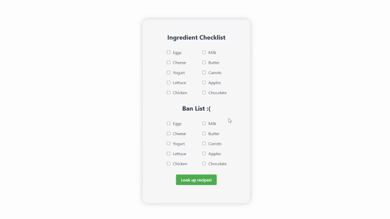

## 🎯 Goals

- [x] Make a static API call using async/await and save the results to a state variable
- [x] Be able to add and edit query parameters for API calls
- [x] Parse JSON data from an unfamiliar API

## ❗ Required Features

- [x] Clicking a button creates a new API fetch request and displays at least three attributes from the returned JSON data
- [x] Only one item/API call is viewable at a time
- [x] API calls should appear random to the user
- [x] At least one image is displayed per API call
- [x] Clicking on a displayed value for one attribute adds it to a displayed ban list
- [x] Attributes on the ban list prevent further images/API results with that attribute from being displayed

## 🚀 Stretch Features

- [x] Multiple types of attributes can be added to the ban list
- [ ] Users can see a stored history of their previously viewed items from this session

 

GIF created with [Ezgif](https://ezgif.com/)
